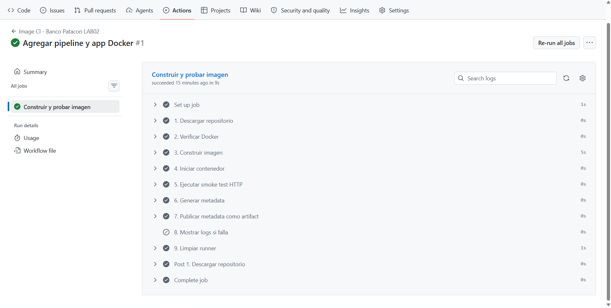
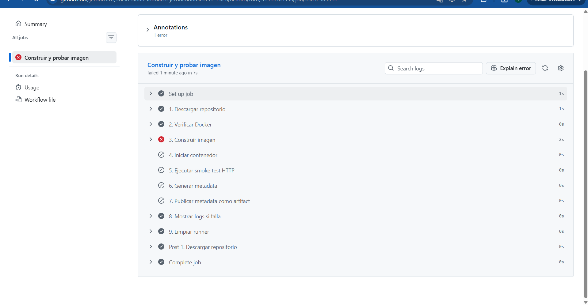
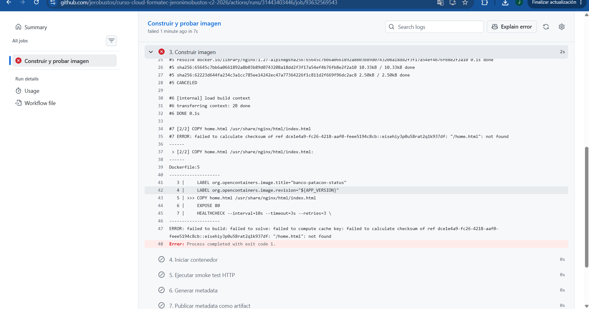

# Entrega M3-C4 LAB02 — Docker y CI 

## Actividad 8: Respuestas

**1. ¿Por qué el checkout debe ejecutarse antes de docker build?**
Porque el runner de GitHub Actions inicia como una máquina virtual completamente en blanco. El paso de checkout es el encargado de descargar el código fuente de tu repositorio (incluyendo el Dockerfile y el index.html) dentro de esa máquina. Sin esos archivos, el comando docker build no tendría un contexto ni las instrucciones necesarias para construir la imagen.

**2. ¿Qué prueba el build y qué prueba el smoke test?**
* El build prueba la viabilidad: Confirma que el Dockerfile está bien escrito, que las dependencias base se pueden descargar y que el proceso de empaquetado finaliza sin errores.
* El smoke test prueba el comportamiento: Inicia un contenedor real y verifica que la aplicación esté viva y respondiendo correctamente a las peticiones.

**3. ¿Por qué la imagen usa el SHA del commit y no solamente la etiqueta latest?**
Para garantizar la trazabilidad. La etiqueta latest es ambigua y mutable; si algo falla en producción, ver latest no te dice qué versión del código está corriendo. Usar el SHA del commit vincula esa imagen de forma única, exacta e inmutable a los cambios de código específicos en Git que la originaron.

**4. ¿Por qué el artifact contiene metadata (un archivo de texto) y no la imagen Docker completa?**
Porque las imágenes Docker son archivos pesados y GitHub Actions no está diseñado para funcionar como un almacén de imágenes. Subir la imagen completa como un artifact haría que el pipeline fuera lento y consumiría cuota innecesariamente. Un archivo de texto con la metadata es liviano, rápido y provee toda la evidencia necesaria para auditar la construcción.

**5. ¿Dónde queda la imagen cuando termina el runner de GitHub Actions?**
La imagen se destruye. Los runners alojados por GitHub son entornos efímeros (descartables). Una vez que todos los pasos finalizan, la máquina virtual completa se elimina, borrando de forma permanente todo su contenido.

**6. ¿Qué step agregarías después para publicar en un registry?**
Se necesitarían agregar dos pasos lógicos al final del pipeline:
1. Un paso de autenticación (Login): Para iniciar sesión en el registry utilizando credenciales seguras.
2. Un paso de subida (docker push): Para enviar la imagen al registry remoto.

---

## Evidencias Fotográficas

Aquí se muestra la ejecución exitosa del pipeline:

Aquí se muestra el comportamiento ante el fallo controlado:

